# Walmart Store Sales Forecasting — ML Final Project

[Kaggle Competition: Walmart Recruiting - Store Sales Forecasting](https://www.kaggle.com/competitions/walmart-recruiting-store-sales-forecasting) — 45 მაღაზიის, ~80 დეპარტამენტის ყოველკვირეული გაყიდვების პროგნოზი. მეტრიკა: **Weighted MAE** (სადღესასწაულო კვირებს ×5 წონა).

## გუნდი და როლების განაწილება

| მოდელი | ვინ ატრენინგებდა | ლოგირება |
|--------|-------------------|----------|
| XGBoost | Zaqaria | MLflow / DagsHub |
| N-BEATS | Zaqaria | WandB |
| PatchTST | Zaqaria | WandB |
| TFT | Zaqaria | WandB |
| ARIMA/SARIMA | Zaqaria | MLflow / DagsHub |
| LightGBM | Giga | MLflow / DagsHub |
| DLinear | Giga | WandB |
| Prophet | Giga | MLflow / DagsHub |
| TimesFM (bonus) | Giga | WandB |
| Ensemble (XGBoost + Prophet) | Team | MLflow / DagsHub |

## Tracking Links

- **MLflow (DagsHub) — ყველა tree-based + classical + ensemble:** https://dagshub.com/zberi23/walmart-forecasting.mlflow
- **WandB — Zaqaria-ს DL მოდელები (N-BEATS, PatchTST, TFT):** https://wandb.ai/zberi23_ml/walmart-forecasting
- **WandB — Giga-ს DL მოდელები (DLinear, TimesFM):** https://wandb.ai/gbera23-free-university-of-tbilisi-/walmart-forecasting

## Exploratory Data Analysis

დეტალური EDA ხდება `eda_and_feature_engineering.ipynb`-ში და მეორდება (ოდნავ სხვადასხვა კუთხით) სულ მინიმუმ ოთხ ცალკეულ notebook-ში: `model_experiment_XGBoost.ipynb`, `model_experiment_LightGBM.ipynb`, `walmart_ensemble_forecast.ipynb` და `model_experiment_ARIMA.ipynb`. ქვემოთ ყველა ეს ანალიზი თავმოყრილია ერთად, წყაროს მიხედვით დაჯგუფებული.

### XGBoost notebook-ის EDA

**Missing values** — MarkDown1–5 ყველაზე missing-heavy სვეტებია (ეს პრომოუშენ-პროგრამა მხოლოდ 2011 წლის ნოემბრიდან დაიწყო), CPI და Unemployment-საც აქვს მცირე ნაწილი აკლია:

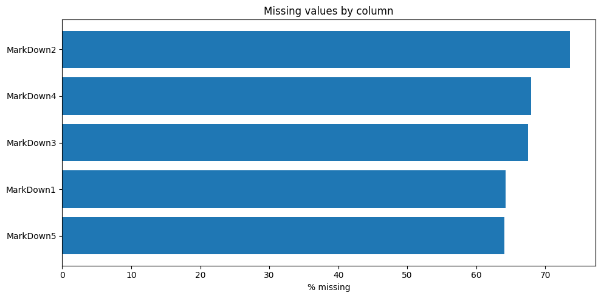

**Target-ის განაწილება** — `Weekly_Sales` ძლიერად right-skewed არის (რამდენიმე store/dept კომბინაცია ბევრად აღემატება უმეტესობას); `log1p`-ტრანსფორმაცია განაწილებას საგრძნობლად ალაგებს:

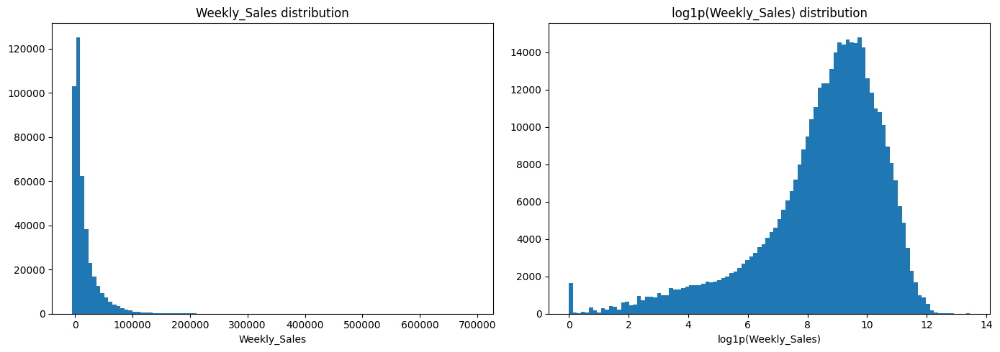

**სეზონურობა და holiday ეფექტი** — საშუალო კვირეული გაყიდვები მკვეთრად იზრდება holiday კვირებში (წითელი ხაზები) — განსაკუთრებით Thanksgiving/Christmas პერიოდში — რაც პირდაპირ ამართლებს competition-ის ×5 წონას ამ კვირებზე:

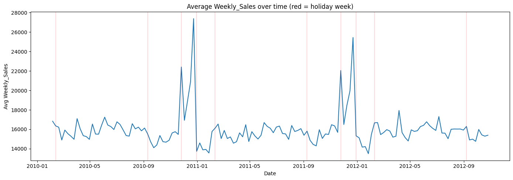

**Store Type / Size / Department ეფექტები** — Type A მაღაზიები (ყველაზე დიდი) საშუალოდ ყველაზე მეტს ყიდიან, `Size`-სა და `Weekly_Sales`-ს შორის დადებითი კავშირია, დეპარტამენტებს შორის კი საშუალო გაყიდვები ათეულჯერ განსხვავდება:


**კორელაცია რიცხვით ცვლადებს შორის** — ეკონომიკური ცვლადები (`CPI`, `Fuel_Price`, `Unemployment`, `Temperature`) სუსტად კორელირებენ `Weekly_Sales`-თან პირდაპირ; `Size` ყველაზე ძლიერი წრფივი კავშირის მქონეა:

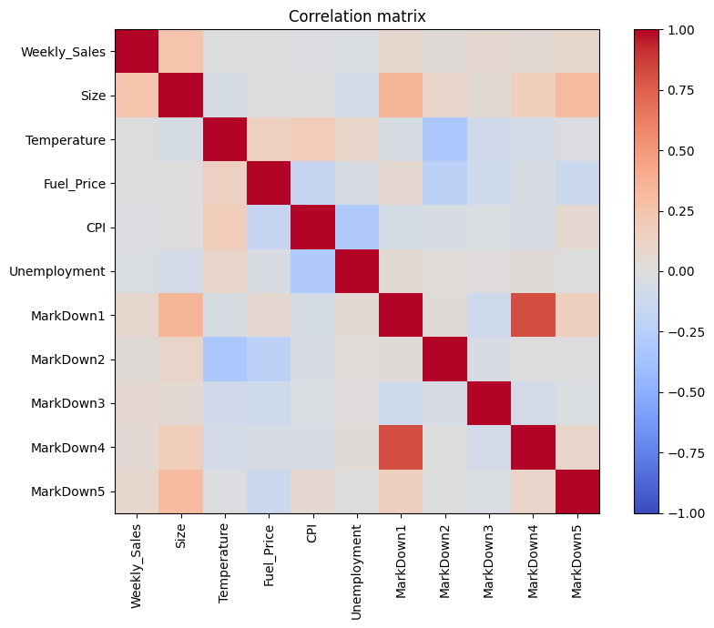

### LightGBM notebook-ის EDA

**გაყიდვების განაწილება (გადაკვეთილი დიაპაზონი)** — უარყოფითი `Weekly_Sales` მნიშვნელობები (დაბრუნებები/კორექციები) მცირე, მაგრამ არანულოვანი წილია; [-5000, 30000] დიაპაზონზე გადაკვეთა განაწილების ბირთვს უფრო კარგად აჩვენებს:

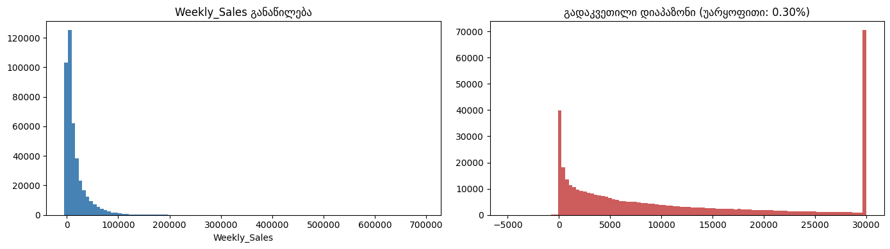

**ჯამური კვირეული გაყიდვები დროში** — ყველა store/dept-ის ჯამური (და არა საშუალო) გაყიდვები, რომელიც კიდევ უფრო მკვეთრად უსვამს ხაზს Thanksgiving/Christmas პიკებს; holiday vs non-holiday საშუალოს შედარება ცალკეა დათვლილი:

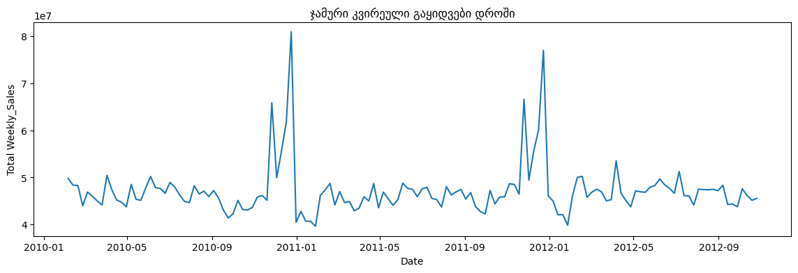

**Store Type-ის ეფექტი და Size-ის განაწილება** — Store Type-ის მიხედვით საშუალო გაყიდვების შედარება, პლუს ცალკე panel Store Size-ის განაწილებაზე (ყველა 45 მაღაზია):

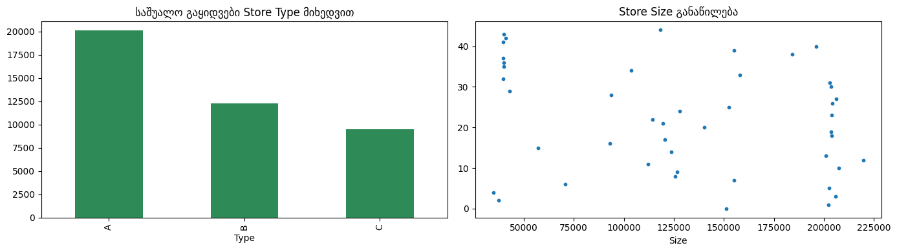

**კორელაცია Weekly_Sales-თან (annotated heatmap)** — იგივე ეკონომიკური ცვლადები, ამჯერად რიცხვითი მნიშვნელობებით ცხრილში, XGBoost-ის ვერსიის დამატებითი გადამოწმებისთვის:

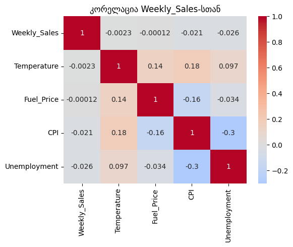

### Ensemble notebook-ის EDA

**Missing values + სერიების სიგრძის განაწილება** — იგივე missing-values სურათი, პლუს ახალი panel: რამდენი კვირის ისტორია აქვს თითოეულ (Store, Dept) სერიას — ეს პირდაპირ განმარტავს, რატომ სჭირდება lag/rolling ფიჩერებს fallback მნიშვნელობები ახალი ან მოკლე-ისტორიის მქონე სერიებისთვის:

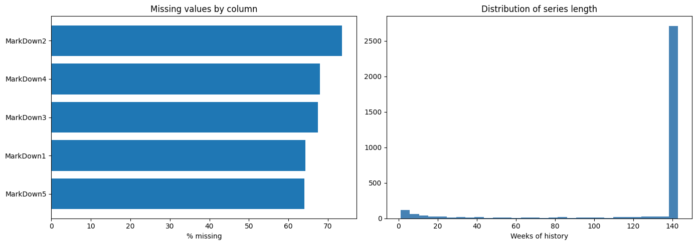

**განაწილება + სეზონურობა ერთად** — `Weekly_Sales`-ის ჰისტოგრამა და დროში საშუალო გაყიდვების გრაფიკი (holiday კვირების highlight-ით) ერთ ფიგურაში, სწრაფი side-by-side შედარებისთვის:

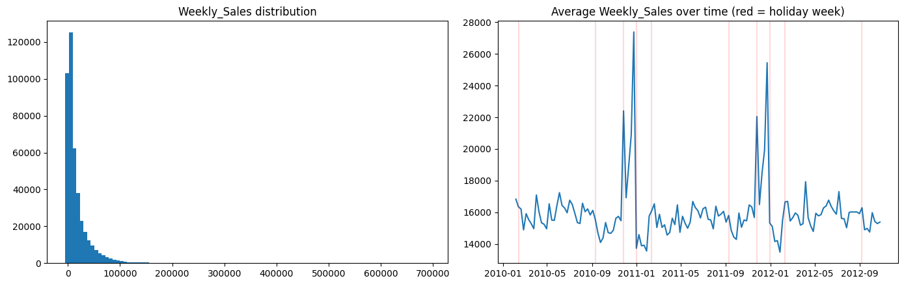

**Store Type / Size / Department ეფექტები** — იგივე სამი panel, რაც XGBoost-ის ვერსიაშია, დამოუკიდებლად გამოთვლილი Ensemble notebook-ში — შედეგები თანმხვედრია, რაც დამატებით ადასტურებს feature engineering-ის მიმართულებას ორივე branch-ისთვის (XGBoost + Prophet):

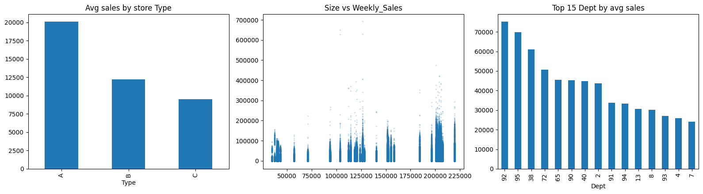

### ARIMA notebook-ის EDA — ცალკეული სერიის ინსპექცია

**ტოპ (Store, Dept) სერიის დეტალური გრაფიკი** — per-series მოდელებისთვის (ARIMA/SARIMA) საჭირო იყო კონკრეტული სერიის ვიზუალური შემოწმება ტრენინგამდე: აი ყველაზე მაღალი საშუალო გაყიდვების მქონე (Store, Dept) კომბინაციის სრული ისტორია — ჩანს მკვეთრი წლიური სეზონურობა და holiday spike-ები ინდივიდუალურ სერიაზეც, არა მხოლოდ დაჯგუფებულ საშუალოზე:

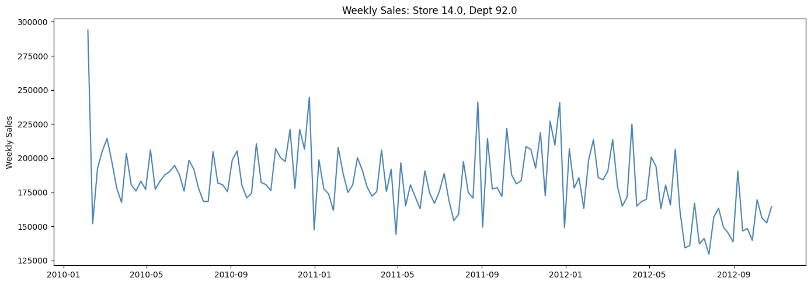

### დასკვნები EDA-დან (ოთხივე notebook-ში თანმხვედრი)

- `Weekly_Sales` ძლიერად skewed არის, Store/Dept/Size ცვლადები ყველაზე მეტ ვარიაციას ხსნიან
- Holiday კვირები საშუალოდ უფრო მაღალი გაყიდვებით გამოირჩევა — ეს ამართლებს competition-ის ×5 წონას
- MarkDown1–5 ყველაზე missing-heavy სვეტებია (პრომოუშენ-პროგრამა მხოლოდ 2011 წლის ნოემბრიდან დაიწყო)
- ეკონომიკური ცვლადები (`CPI`, `Fuel_Price`, `Unemployment`, `Temperature`) სუსტად კორელირებენ სამიზნესთან პირდაპირ, მაგრამ store/dept-ის კონტექსტში მაინც სასარგებლო სიგნალს იძლევიან
- Dept-დონის ვარიაცია იმდენად დიდია, რომ lag/rolling და Dept×Week სეზონური ფიჩერები (იხ. XGBoost/LightGBM notebook-ები) მნიშვნელოვან სარგებელს იძლევა სუფთა calendar/store ფიჩერებთან შედარებით
- ცალკეული (Store, Dept) სერიები ინდივიდუალურადაც აჩვენებენ იმავე წლიურ სეზონურობას, რაც დაჯგუფებულ საშუალოშია ხილული — ეს ამართლებს per-series (ARIMA/SARIMA, TimesFM) და Store×Dept lag-ზე დაფუძნებულ (XGBoost, LightGBM) მიდგომებს ორივეს

## TL;DR — 10 მოდელის შედარება

ვალიდაცია — ბოლო 12 კვირა (chronological split, per-series DL-ისთვის, global 90/10 tree-ისთვის; Prophet და Ensemble — სრული პოპულაცია).

| Rank | Model | Category | Val WMAE | Type |
|------|-------|----------|----------|------|
| 🥇 1 | **TimesFM** | Foundation Model | **1309.76** | **Zero-shot** |
| 🥈 2 | XGBoost | Tree-based | 1321.74 | Trained |
| 🥉 3 | Prophet (full population) | Classical | 1331.57 | Trained |
| 4 | Ensemble (XGBoost + Prophet) | Ensemble | 1332.23 | Weighted blend |
| 5 | LightGBM | Tree-based | 1342.90 | Trained |
| 6 | N-BEATS | DL (feed-forward) | 1378.04 | Trained |
| 7 | PatchTST | DL (transformer) | 1420.44 | Trained |
| 8 | DLinear | DL (linear) | 1494.80 | Trained |
| 9 | TFT | DL (LSTM + attention) | 1538.41 | Trained |
| 10 | SARIMA | Classical | 7012.96¹ | Trained |

¹ *SARIMA ტოპ 5 (Store, Dept) სერიაზე მხოლოდ — per-series მოდელი, 3000+ სერიაზე ტრენინგი პრაქტიკული არ იყო.*

**გამარჯვებული:** **TimesFM** (zero-shot) — pretrained foundation model, რომელსაც Walmart-ის მონაცემები ტრენინგისას არასოდეს უნახავს, აჯობა ყველა სპეციალურად ტრენინგირებულ მოდელს — თუმცა მინიმალური მარჟით. XGBoost-ის feature engineering-ის განახლების შემდეგ (Store×Dept lag/rolling ისტორია + Dept×Week სეზონური საშუალო) მისი val WMAE 1321.74-მდე ჩამოვიდა, რაც TimesFM-ს მხოლოდ 11.98 ერთეულით ჩამორჩება — პრაქტიკულად noise-ის ფარგლებშია. `model_inference.ipynb` ამ ეტაპზე კვლავ TimesFM-ს იყენებს საბოლოო Kaggle submission-ის გენერირებისთვის, რადგან ის ოფიციალური val WMAE-ით წინაა.

## Kaggle Submission

TimesFM final submission Kaggle-ის private leaderboard-ზე:

| Score Type | WMAE |
|-----------|------|
| **Private Score** | 2717.26 |
| Public Score | 2647.91 |

## Repo Structure

```
walmart-forecasting/
│
├── eda_and_feature_engineering.ipynb   # EDA + shared preprocessing
├── images/                         # EDA-ს ვიზუალები (README-ში ჩასმული)
│
├── model_experiment_XGBoost.ipynb      # Zaqaria
├── model_experiment_NBEATS.ipynb       # Zaqaria
├── model_experiment_PatchTST.ipynb     # Zaqaria
├── model_experiment_TFT.ipynb          # Zaqaria
├── model_experiment_ARIMA.ipynb        # Zaqaria — classical
│
├── model_experiment_LightGBM.ipynb     # Giga
├── model_experiment_DLinear.ipynb      # Giga
├── model_experiment_Prophet.ipynb      # Giga — classical, full population
├── model_experiment_TimesFM.ipynb      # Giga — bonus, winner
│
├── walmart_ensemble_forecast.ipynb     # Team — XGBoost + Prophet ensemble
│
├── model_inference.ipynb               # საბოლოო submission generation (TimesFM)
│
└── README.md                           # ეს ფაილი
```

Kaggle-ის data (`train.csv.zip`, `test.csv.zip`, `stores.csv`, `features.csv.zip`) რეპოში არ არის — ჩამოტვირთვის ინსტრუქცია EDA notebook-ის Setup სექციაშია.

## თითო მოდელის მოკლე აღწერა

### 1. TimesFM (Giga) — გამარჯვებული

**3 WandB runs:** ZeroShot / LongContext / Final

- Google-ის **pretrained** foundation model (`google/timesfm-2.5-200m-pytorch`, decoder-only transformer)
- **Zero-shot forecasting** — არავითარი training არ ხდება!
- საუკეთესო: **LongContext** (256-week context) — val WMAE **1309.76**
- **აჯობა ყველა დანარჩენ მოდელს** — tree-based, classical და ensemble-ის ჩათვლით — მიუხედავად იმისა, რომ Walmart-ის data-ს არასოდეს ნახა
- Foundation model paradigm-ის ძლიერი დადასტურება time-series-ისთვის

### 2. XGBoost (Zaqaria)

**6 MLflow runs:** `XGBoost_EDA`, `XGBoost_Cleaning`, `XGBoost_Feature_Selection`, `XGBoost_CrossValidation`, `XGBoost_HyperparameterTuning`, `XGBoost_Final`

- Custom `WalmartPreprocessor` sklearn Transformer Pipeline-ის შიგნით (merge stores + features, fillna, feature engineering)
- Feature set-ების შედარებაში (`all` / `no_markdown` / `core` / `extended`) გაიმარჯვა **`extended`** — Store×Dept lag/rolling ისტორია (`lag_1`, `lag_52`, `roll_4_mean`, `roll_12_mean`, `store_dept_expanding_median`) და **Dept×Week სეზონური საშუალო** (`Dept_Week_Seasonal_Avg`) — ეს ბოლო ფიჩერი დეპარტამენტის საშუალო გაყიდვებს კონკრეტულ კალენდარულ კვირაზე იჭერს და პირდაპირ სწვდება holiday-სპეციფიკურ spike-ებს
- 9 curated ჰიპერპარამეტრი კონფიგურაციის შედარება (`max_depth`/`learning_rate`/`regularization` balance), holiday sample weight (`sample_weight`) გამოყენებული ტრენინგის ყველა ეტაპზე — feature selection, CV, tuning, final
- val WMAE **1321.74** (421,570 training rows) — მნიშვნელოვანი გაუმჯობესება, TimesFM-ს მხოლოდ 11.98 WMAE-ით ჩამორჩება
- **Model Registry: `walmart_xgboost` v3 → Production**
### 3. Prophet (Giga) — სრული პოპულაცია

**4 MLflow runs:** `Prophet_Baseline`, `Prophet_Holidays`, `Prophet_Tuned`, `Prophet_FullPopulation`

- Facebook Prophet (additive: trend + seasonality + holidays)
- Walmart-specific holidays Prophet-ის native `holidays=` მექანიზმით (Super Bowl, Labor Day, Thanksgiving, Christmas)
- ჰიპერპარამეტრების ძებნა ფიქსირებულ sample-ზე, საუკეთესო კონფიგურაცია შემდეგ **მთელ** Store/Dept პოპულაციაზე გაეშვა (წინა ვერსია მხოლოდ ტოპ 5 სერიას ფარავდა)
- Full-population val WMAE **1331.57** — მკვეთრი გაუმჯობესება წინა (top-5-only) ვერსიასთან შედარებით

### 4. Ensemble — XGBoost + Prophet (Team)

`walmart_ensemble_forecast.ipynb` ორ დამოუკიდებელ branch-ს აერთიანებს ერთსა და იმავე held-out ვალიდაციის ფანჯარაზე:

- **XGBoost branch** — raw `Store/Dept/Date/IsHoliday`-ს იღებს, sklearn Pipeline-ის შიგნით merge + feature engineering + tuned XGBoost
- **Prophet branch** — per-series, native holidays, სრული პოპულაცია
- ორი combination სტრატეგია შედარებულია: **weighted blend** (`alpha * xgb + (1-alpha) * prophet`, RMSE-ზე ოპტიმიზებული alpha) და **stacked meta-model** (cross-fit non-negative Ridge)
- **Weighted blend** გაიმარჯვა — val WMAE **1332.23**

### 5. LightGBM (Giga)

**5 MLflow runs:** იგივე სტრუქტურა, რაც XGBoost-ს, დამატებული lag/rolling ფიჩერებით.

- feature set: `lag_rolling_onehot` — Store×Dept lag/rolling სტატისტიკები + one-hot (`Store`, `Dept`, `Day_of_Week`, `Month`)
- საუკეთესო ჰიპერპარამეტრები: `num_leaves=127`, `learning_rate=0.03`, `max_depth` შეუზღუდავი
- val WMAE **1342.90**
- **Model Registry: `walmart_lightgbm` v2 → Staging**

### 6. N-BEATS (Zaqaria)

**5 WandB runs:** `NBEATS_Baseline`, `NBEATS_Interpretable`, `NBEATS_LongContext`, `NBEATS_Final`, `NBEATS_ModelArtifact`

- Global model — ერთი მოდელი 2934 (Store, Dept) time series-ისთვის
- საუკეთესო კონფიგი: **Long Context** (52-week input + trend/seasonality stacks) — val WMAE **1378.04**
- Interpretable mode (polynomial trend + Fourier seasonality basis) Walmart-ის yearly cycles-ს კარგად ითვისებს

### 7. PatchTST (Zaqaria)

**5 WandB runs:** `PatchTST_Baseline`, `PatchTST_LargerPatch`, `PatchTST_Deeper`, `PatchTST_Final`, `PatchTST_ModelArtifact`

- Transformer-based (patching + channel independence)
- საუკეთესო: **Deeper** (6 encoder layers, hidden=256, 8 heads) — val WMAE **1420.44**
- PatchTST-ის transformer complexity Walmart-ის სპეციფიკურ patterns-ს შედარებით ცოტა ეხმარება

### 8. DLinear (Giga)

**5 WandB runs:** Baseline / Longer Window / Longer Training / Final / Model Artifact

- უბრალო architecture: მხოლოდ ორი Linear layer (trend decomposition + seasonal decomposition)
- საუკეთესო: Longer Training (1500 steps, LR=5e-4) — val WMAE **1494.80**
- **სიმარტივის თეზისი დადასტურდა**: DLinear PatchTST-ს მხოლოდ 5%-ით ჩამორჩება, მაგრამ 3-4x სწრაფად ტრენინგდება

### 9. TFT (Zaqaria)

**4 WandB runs:** `TFT_Baseline`, `TFT_ExogEnriched`, `TFT_Tuned`, `TFT_Final`

- LSTM encoder/decoder + multi-head attention + gating (`neuralforecast`)
- Static covariates (`Store`, `Dept`) + future-known covariates (`IsHoliday`, calendar features) — ერთდროულად
- საუკეთესო: **Tuned** (52-week input, hidden_size=128, 2-layer LSTM) — val WMAE **1538.41** (25 epoch-ის შემდეგ, train loss ≈ 1.62)
- N-BEATS/PatchTST-ს ვერ აჯობა ამ dataset-ზე — heterogeneous input-ების gating-ის სირთულემ ამ ზომის მონაცემებზე გადაწონა capacity-ის სარგებელი

### 10. ARIMA/SARIMA (Zaqaria)

**4 MLflow runs:** `ARIMA_Stationarity`, `ARIMA_Baseline`, `SARIMA_Seasonal`, `ARIMA_Final`

- Box-Jenkins მიდგომა — ADF + KPSS ტესტები, ACF/PACF ანალიზი
- Recommended: `d=1, D=1, s=52` (double differencing needed)
- ARIMA(1,1,1) baseline WMAE **12302.90**
- SARIMA(1,1,1)(1,1,1)_52 WMAE **7012.96** — **43% შემცირება**. სეზონურობის დამატება ცხადად ცვლის შედეგს
- ტესტი მხოლოდ ტოპ 5 (Store, Dept) სერიაზე (per-series model, 3000+ სერიაზე ტრენინგი პრაქტიკული არ იყო)

## საბოლოო Pipeline (TimesFM)

Winner მოდელმა (TimesFM) **არ საჭიროებს fine-tuning-ს** — inference notebook-ში პირდაპირ pretrained checkpoint-ს ვტვირთავთ:

```
raw train.csv (ისტორია → context)   raw test.csv (თარიღები → horizon)
         │                                   │
         └──────────────┬────────────────────┘
                         ▼
              long-format (unique_id, ds, y)
                         │
                         ▼
        TimesFM (google/timesfm-2.5-200m-pytorch)
         256-week context, zero-shot forecast
                         │
                         ▼
     merge Store/Dept/Date-ზე + fallback (median)
                         │
                         ▼
                  Kaggle submission
```

**inference notebook-ში:**
```python
tfm = timesfm.TimesFM_2p5_200M_torch.from_pretrained("google/timesfm-2.5-200m-pytorch")
tfm.compile(timesfm.ForecastConfig(max_context=512, max_horizon=39, ...))
point_forecast, _ = tfm.forecast(horizon=horizon, inputs=[context])  
```

## Model Registry Status

DagsHub Model Registry-ში (tree-based / classical მოდელებისთვის — TimesFM pretrained checkpoint-ია, registry-ს არ საჭიროებს):

| Model Name | Version | Stage |
|-----------|---------|-------|
| `walmart_xgboost` | v3 | Production|
| `walmart_lightgbm` | v2 | Staging |
| `walmart_ensemble` | v1 | Staging |

## Setup და Reproduction

### 1. Prerequisites

```
Colab (Free/Pro), Google Drive, DagsHub account, WandB account, Kaggle account
```

### 2. Drive Structure

```
/content/drive/MyDrive/walmart/
├── data/
│   ├── train.csv.zip
│   ├── test.csv.zip
│   ├── stores.csv
│   ├── features.csv.zip
│   └── sampleSubmission.csv.zip
├── models/       
└── submissions/ 
```

### 3. Secrets (Colab)

- `KAGGLE_USERNAME` + `KAGGLE_KEY` — Kaggle API (მონაცემების ჩამოტვირთვისთვის)
- `WANDB_API_KEY` — WandB tracking-ისთვის
- DagsHub — `dagshub.init()` browser-ის auth-ს ითხოვს

### 4. თანმიმდევრობა

1. `eda_and_feature_engineering.ipynb` — EDA + preprocessed CSV-ების შენახვა Drive-ზე
2. თითო `model_experiment_*.ipynb` — ცალკე ტრენინგდება
3. `walmart_ensemble_forecast.ipynb` — XGBoost + Prophet ensemble
4. `model_inference.ipynb` — საბოლოო submission-ის generation (TimesFM)

**GPU საჭიროა:** N-BEATS, PatchTST, TFT, DLinear, TimesFM — Runtime → T4 GPU
**CPU საკმარისია:** XGBoost, LightGBM, ARIMA, Prophet, Ensemble

## საერთო დასკვნები

1. **Foundation models tree-based-ს თითქმის თანაბრად ეჯიბრება** — TimesFM zero-shot-ით (არავითარი training!) ისევ **საუკეთესო** მოდელია, მაგრამ marginალურად — 1309.76 vs XGBoost-ის გაუმჯობესებული 1321.74.

2. **Per-series კლასიკური მოდელებიც კონკურენტუნარიანი შეიძლება იყოს** — სრულ პოპულაციაზე გატრენინგებულმა Prophet-მა (1331.57) გაცილებით აჯობა თავის ძველ top-5-only ვერსიას და პრაქტიკულად TimesFM-ის დონეზეა.

3. **Ensembling ღირს მხოლოდ იმდენად, რამდენადაც branch-ები ცალკე კარგია** — XGBoost + Prophet weighted blend (1332.23) მშენებლობის დროს Prophet-ს მსუბუქად სჯობდა, მაგრამ XGBoost-ის feature engineering-ის შემდგომმა გაუმჯობესებამ (1321.74) თავად ensemble-იც გადააჭარბა — ცალკეული საუკეთესო branch-ი ხანდახან თავად ensemble-ს სჯობს, თუ ის საკმარისად გაუმჯობესდა.

4. **სიმარტივე ხშირად უპირატესია** — DLinear (2 linear layer) PatchTST-ს (transformer) მხოლოდ 5%-ით ჩამორჩება. "Are Transformers Effective for Time Series?" — ხშირად არა.

5. **Architecture complexity არ იძლევა გარანტირებულ სარგებელს** — TFT-ის heterogeneous gating (static + future-known + observed inputs) ამ dataset-ის ზომაზე ვერ აჯობა უფრო მარტივ N-BEATS/PatchTST-ს (val WMAE 1538.41 vs 1378–1420).

6. **Domain knowledge > automatic feature discovery** — SARIMA-ს explicit s=52 seasonality-მ Prophet-ის ძველ automatic detection-ს აჯობა Walmart-ისთვის (თუმცა Prophet-ის სრული-პოპულაციის refit-მა ეს უფსკრული დახურა).

7. **Custom Pipeline design ღირს** — Custom sklearn Transformer-ი (`WalmartPreprocessor`) preprocessing-ს Pipeline-ის შიგნით ატარებს XGBoost/LightGBM/Ensemble-ისთვის, რაც raw test set-ზე inference-ს ამარტივებს; TimesFM-ისთვის კი მსგავს როლს raw history-ზე პირდაპირი zero-shot inference თამაშობს — არც აქ სჭირდება ცალკე preprocessing გაშვება.
